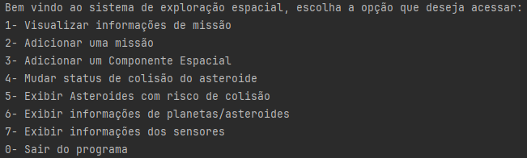
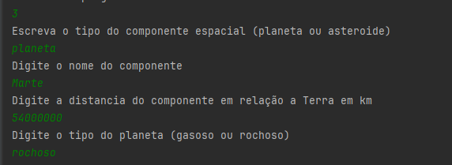
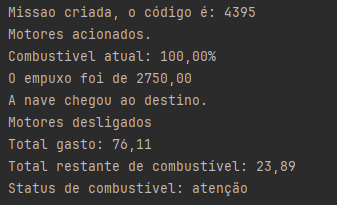
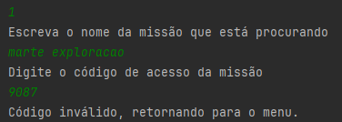
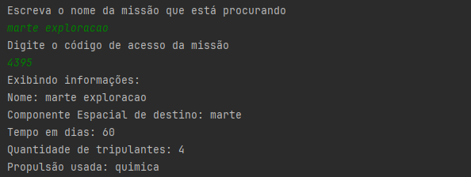
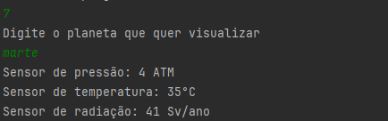

# **Global Solution 2026.1 — 2º Ano de Ciência da Computação (FIAP)**

## 📋 Sobre o Projeto
Este projeto é um ecossistema de software concebido para o monitoramento inteligente e controle operacional de missões espaciais experimentais. O projeto aplica conceitos rigorosos de **Programação Orientada a Objetos (POO)** em Java para solucionar desafios reais de telemetria, gerenciamento de propulsão, análise de habitabilidade planetária e mitigação de riscos astronômicos (como o rastreamento e colisão de asteroides).

---

## 🛠️ Escolhas Técnicas e Arquitetura

### 🧬 Orientação a Objetos Avançada
* **Classes Abstratas:** Implementação da classe base `ComponenteEspacial` (servindo de molde genérico para corpos celestes) e `SistemaPropulsao` (para encapsular comportamentos de motores).
* **Polimorfismo & Herança:** Subclasses especializadas (`Planeta`, `Asteroides`, `PropulsaoQuimica`, `PropulsaoEletrica`) que estendem o comportamento de suas classes mães e sobrescrevem assinaturas cruciais, como os métodos de exibição e o cálculo de aceleração.
* **Interfaces:** Utilização da interface `Sensor` para estabelecer um contrato estrito de funcionamento que obriga todos os módulos de leitura (`SensorTemperatura`, `SensorPressao`, `SensorRadiacao`) a seguirem o mesmo padrão de telemetria.

### 📦 Modularização e Organização (Packages)
Para garantir legibilidade, manutenibilidade e alta coesão, o código foi segmentado em pacotes com responsabilidades bem definidas:
* `br.com.fiap.componentes`: Modelagem física dos corpos espaciais e validações de habitabilidade.
* `br.com.fiap.propulsao`: Motores, cálculos de empuxo e gerenciamento crítico de energia/combustível.
* `br.com.fiap.sensor`: Hardware simulado para captura de dados atmosféricos.
* `br.com.fiap.dadosMissao`: Camada de encapsulamento com restrição de acesso a dados confidenciais de trajetória.
* `br.com.fiap.main`: Orquestração do sistema, contendo o fluxo de menus e inicialização.

### 🛡️ Validações Estritas e Controle de Fluxo (`Do-While`)
Utilização de estruturas de repetição `do-while` acopladas a verificações condicionais para impedir a entrada de dados corrompidos ou inválidos. O sistema garante que:
* Nomes e tipos de componentes não sejam vazios.
* Distâncias e tempos de expedição sejam estritamente positivos.
* Tripulações limitem-se aos padrões de segurança homologados (mínimo 1, máximo 10 tripulantes).

### 🎛️ Fluxo Baseado em Console (`Scanner` e Controle de Memória)
Interação dinâmica com o usuário via terminal utilizando a classe `Scanner`. O fluxo principal foi blindado por meio de desvios condicionais com retornos limpos (`return null`), evitando o empilhamento redundante de menus na memória (*Stack Overflow*) e garantindo a persistência das listas de dados durante toda a execução do programa.

### 🎲 Simulação Estocástica (`Random`)
A biblioteca `java.util.Random` foi aplicada para simular com fidelidade as variáveis imprevisíveis do ambiente espacial:
* **Sorteio de Atividade:** Define uma taxa de 5% de chance de falha crítica nos sensores de hardware.
* **Telemetria Dinâmica:** Geração de valores aleatórios de radiação, temperatura e pressão absoluta para testes de sobrevivência.
* **Consumo de Recursos:** Geração matemática do gasto energético, empuxo gerado e queima de combustível após acelerações.

### 🚩 Flags de Controle (Variáveis Booleanas)
Uso estratégico de variáveis booleanas de estado (ex: `isDestinoExistente`, `isDestinoExploravel`) em conjunto com estruturas de repetição `for-each` para otimização de buscas lineares dentro das coleções de dados.

---

## 🚀 Funcionalidades Principais

1. **Menu Interativo:** Painel centralizado no console para navegação entre missões, componentes, alteração de status de risco e sensores.
2. **Cadastro Dinâmico de Componentes:** Suporte para novos corpos celestes, segmentando especificidades entre planetas (rochosos/gasosos) e asteroides.
3. **Cálculo de Propulsão Realista:** Motorização automatizada que calcula o empuxo necessário, monitora o consumo do tanque e emite alertas dinâmicos de combustível (ex: `status de combustível: atenção`).
4. **Segurança de Tráfego Espacial:** Rastreamento e alteração de status de risco de colisão de asteroides.
5. **Acesso Restrito:** Proteção de dados confidenciais de voo (coordenadas e trajetórias) por meio de chaves numéricas de acesso geradas dinamicamente de forma segura.
6. **Gerenciamento de Telemetria:** Coleta automática de dados atmosféricos via sensores com verificação de limites (ATM, °C, Sv/ano).

---

## 📸 Demonstração do Sistema (Console)

### 🗺️ Menu Principal e Cadastro de Componentes
| Menu de Opções do Sistema | Cadastro de Novo Planeta (`Marte`) |
| :---: | :---: |
|  |  |

### 🚀 Ciclo de Missão e Segurança de Acesso
| Execução de Missão e Queima de Combustível | Bloqueio por Código de Acesso Inválido |
| :---: | :---: |
|  |  |

### 📊 Detalhes de Missão e Telemetria dos Sensores
| Informações da Missão Homologada | Leitura dos Sensores Ambientais |
| :---: | :---: |
|  |  |

---

## 👥 Integrantes
* **Fernando Caires Silva** - RM563415
* **Guilherme Martins Rezende** - RM563500
* **Raphael Mischiatti de Souza** - RM563567

---
_Desenvolvido em conformidade com as diretrizes acadêmicas da FIAP, 2026._